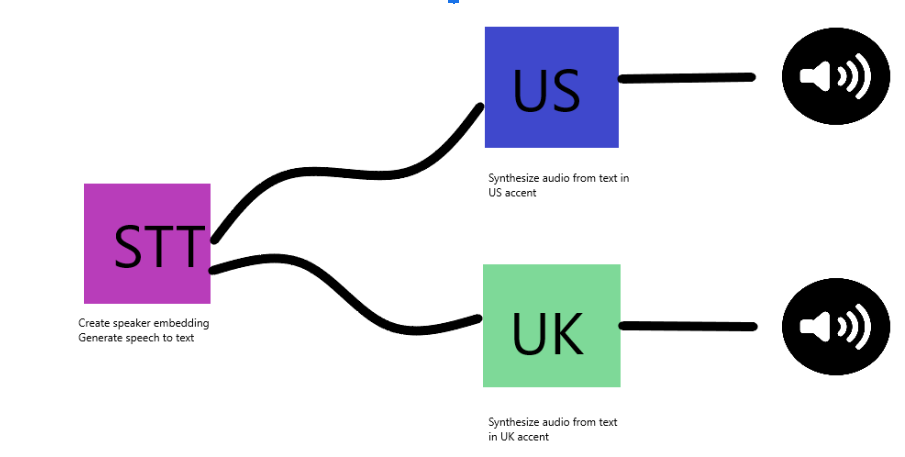

# Real-Time Accent Conversion
Please refer to original repository as this is a slight modification of the original project. [https://github.com/CorentinJ/Real-Time-Voice-Cloning]

### Papers implemented  
| URL | Designation | Title | Implementation source |
| --- | ----------- | ----- | --------------------- |
|[**1806.04558**](https://arxiv.org/pdf/1806.04558.pdf) | **SV2TTS** | **Transfer Learning from Speaker Verification to Multispeaker Text-To-Speech Synthesis** | This repo |
|[1802.08435](https://arxiv.org/pdf/1802.08435.pdf) | WaveRNN (vocoder) | Efficient Neural Audio Synthesis | [fatchord/WaveRNN](https://github.com/fatchord/WaveRNN) |
|[1703.10135](https://arxiv.org/pdf/1703.10135.pdf) | Tacotron (synthesizer) | Tacotron: Towards End-to-End Speech Synthesis | [fatchord/WaveRNN](https://github.com/fatchord/WaveRNN)
|[1710.10467](https://arxiv.org/pdf/1710.10467.pdf) | GE2E (encoder)| Generalized End-To-End Loss for Speaker Verification | This repo |

## Setup

### 1. Install Requirements
1. Both Windows and Linux are supported. A GPU is recommended for training and for inference speed, but is not mandatory.
2. Python 3.7 is recommended. Python 3.5 or greater should work, but you'll probably have to tweak the dependencies' versions. I recommend setting up a virtual environment using `venv`, but this is optional.
3. Install [ffmpeg](https://ffmpeg.org/download.html#get-packages). This is necessary for reading audio files.
4. Install [PyTorch](https://pytorch.org/get-started/locally/). Pick the latest stable version, your operating system, your package manager (pip by default) and finally pick any of the proposed CUDA versions if you have a GPU, otherwise pick CPU. Run the given command.
5. Install the remaining requirements with `pip install -r requirements.txt`

### 2. (Optional) Download Pretrained Models
Download models from here: https://drive.google.com/drive/folders/1hIvW0P2Vj07qsEJ7OTgobfUz6Rr9UgeT?usp=sharing - Save them in the saved_models directory

### 3. (Optional) Download Datasets
- Download the common voice data set https://www.kaggle.com/datasets/mozillaorg/common-voice
- You can retrain the model by selecting a subset of a specific accent you want and placing the data in the correct directory (AccentConversion directory).
- Enjoy!

### 4. (Optional) Test Configuration
Before you download any dataset, you can begin by testing your configuration with:

`python demo_cli.py`

If all tests pass, you're good to go.

### 5. The model explained
Our final model consists of two fine fined tune voice conversion neural networks based on the real time voice conversion repository and the Transfer Learning from Speaker Verification to Multispeaker Text-To-Speech Synthesis paper by google. We essentially discovered that we can fine tune the voice cloning architecture on a dataset consisting only of audio recordings of native British English speakers. This results in an interesting accent convesion methodology as we essentialy clone the voice of the American english speaker while generating words that sound like they are spoken by a person speaking British english. The reason why this works is because we fine tuned to voice cloning model to only generate audio in a certain accent by providing training data in a specific accent. This works both ways as the original real time voice cloning repository model contains a model that can produce audio recordings in an American accent only. If one wants to generate recordings from British english to American english they can download the models presented in the original trepository. As stated, this method of accent conversion is a novel but simple method to convert one's accent to another.

As stated above, the model consists of two duplicate neural networks. Each model is trained on relevant recordings from different accent oriented datasets. Essentially, we train one model on recordings consisting of only british recordings and we train the other model with recordings of only american accents. This gives each individual network the ability to generate sentences in specific accents, so one can convert anything he says into a different accent. If needed, one can add any speech to text algorithm for a full end-to-end audio recording from one accent to another pipeline.

## Play some samples
#### Before conversion to british
[Click here to play the audio](./demo_output/american1.wav)
#### After conversion to british
[Click here to play the audio](./demo_output/british1.wav)
#### Before conversion to british
[Click here to play the audio](./demo_output/american2.wav)
#### After conversion to british
[Click here to play the audio](./demo_output/british2.wav)
#### Before conversion to american
[Click here to play the audio](./demo_output/british3.wav)
#### After conversion to american
[Click here to play the audio](./demo_output/american3.wav)
